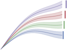

# nomenclature - Working with IAMC-style data templates

Copyright 2021 IIASA

This repository is licensed under the Apache License, Version 2.0 (the "License");  
see the [LICENSE](LICENSE) for details. 

[](https://github.com/IAMconsortium/nomenclature/blob/main/LICENSE)
[](https://github.com/IAMconsortium/pyam)
[](https://github.com/psf/black)

## Overview

This package facilitates working with data templates that follow the format developed by
the [Integrated Assessment Modeling Consortium (IAMC)](https://www.iamconsortium.org).

## The structure of a nomenclature folder

A **Nomenclature** class contains **CodeLists** for *variables* (including units) and
*regions* to be used in a model comparison or scenario exercise using the IAMC format.

A **CodeList** is a list of "allowed terms" (or codes), where each term can have
several attributes (e.g., description, unit, parent region).

The **Nomenclature** is initialized from a folder with the following structure:

### Variables

The *variable* codelist of the nomenclature will be read from all yaml files located
in a folder of that name (including any sub-folders).
They must be formatted as dictionaries.

```yaml
Some Variable:
  description: A short description
  unit: A unit
```

Every variable must have a **unit**, which should be compatible with the 
Python package [iam-units](https://github.com/iamconsortium/units).

#### Tags

To avoid repetition (and subsequent errors), any number of yaml files can be used
as "tags" using nested dictionaries.

```yaml
<Tag>:
  Some Key:
    description: a short description of the key
```

When importing the codelist, any occurrence of `<Tag>` in a variable name will be
replaced by every element in the Tag dictionary. The `<Tag>` will also be replaced
in any of the variable attributes.

There must be only one top-level entry in any yaml file to be used as tag. 

#### Guidelines and naming convention

The variable name (code) should adhere to the following conventions:

- A `|` (pipe) character indicates levels of hierarchy
- Do not use spaces before and after the `|` character,
  but add a space between words (e.g., `Primary Energy|Non-Biomass Renewables`)
- All words must be capitalised (except for 'and', 'w/', 'w/o', etc.)
- Do not use abbreviations (e.g, 'PHEV') unless strictly necessary
- Add hierarchy levels where it might be useful in the future, e.g., use 
  `Electric Vehicle|Plugin-Hybrid` instead of 'Plugin-Hybrid Electric Vehicle'
- Do not use abbreviations of statistical operations ('min', 'max', 'avg')
  but always spell out the word
- Do not include words like 'Level' or 'Quantity' in the variable,
  because this should be clear from the context or unit

### Regions

Coming soon...

## The pyam package



This package is intended to complement the Python package **pyam**,
an open-source community toolbox for analysis & visualization of scenario data.
That package was developed to facilitate working with timeseries scenario data
conforming to the format developed by the IAMC .
It is used in ongoing assessments by the IPCC and in many model comparison
projects at the global and national level, including several Horizon 2020 projects.

[Read the docs](https://pyam-iamc.readthedocs.io) for more information!

## Getting started

To install this package, please install Python version 3.7 or higher. Then,
download or git-clone this repository and run the following command in the root folder:

```
pip install --editable .
```

Then, open a Python console and import a suitable nomenclature structure from a folder
and run the following code to inspect the variables defined in the nomenclature.

```python
import nomenclature
nc = nomenclature.Nomenclature()
nc.variable
```

## Acknowledgement


This package is based on the work initially done in the
[Horizon 2020 openENTRANCE](https://openentrance.eu) project, which aims to  develop,
use and disseminate an open, transparent and integrated  modelling platform
for assessing low-carbon transition pathways in Europe.

Refer to the [openENTRANCE/nomenclature](https://github.com/openENTRANCE/nomenclature)
repository for more information.


This project has received funding from the European Union’s Horizon 2020 research
and innovation programme under grant agreement No. 835896.
